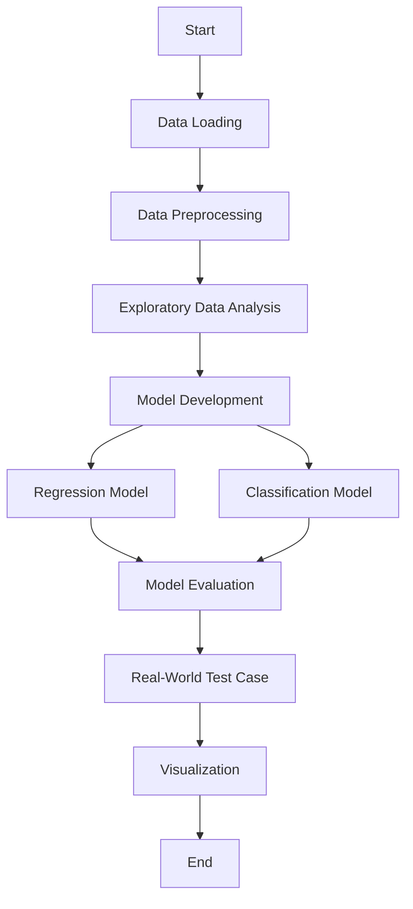

# 🌾 Crop Yield Prediction Machine Learning Model - Advanced README 🌾

## Project Overview 📊

Welcome to the **Crop Yield ML Model** project, developed by *Team Meghdoot* from the 2nd Year, B.Tech CSE (Data Science) program. This project, titled **DEEP DATA HACK**, is driven by our motto **# हर काम देश के नाम** (Every Work for the Nation) 🇮🇳, aiming to leverage machine learning to predict crop yields and assist in agricultural decision-making. By analyzing factors such as geographical location, crop type, seasonal variations, and cultivation area, our model provides insights into expected yields, helping farmers 👨‍🌾 and policymakers make informed choices.

## Team Members 👥

- **Prateek Kumar Prasad** (Roll No: 2301420018) ✨
- **Yatharth Chopra** (Roll No: 2301420022) ✨
- **Akshat Sharma** (Roll No: 2301420027) ✨

## Project Structure 🛠️

The project is implemented in a Jupyter Notebook (`Crop_Yield_ML_Model_Updated_Final.ipynb`) and follows a structured machine learning workflow:

1. **Data Loading and Preprocessing** 📂
2. **Exploratory Data Analysis (EDA)** 📈
3. **Model Development** (Regression and Classification) 🤖
4. **Real-World Test Case** 🌍
5. **Visualization** 📊

## Flowchart 📝



### 1. Data Loading and Preprocessing 📂

- **Dataset**: `crop_yield_train.csv` (276,268 rows × 8 columns) 📋
  - `State`: Categorical (e.g., Jharkhand) 🗺️
  - `District`: Categorical (e.g., RAMGARH) 📍
  - `Crop`: Categorical (e.g., Potato) 🥔
  - `Crop_Year`: Integer (e.g., 2013) 📅
  - `Season`: Categorical (e.g., Winter) ❄️
  - `Area`: Float (hectares) 🌱
  - `Production`: Float (quantity) 📦
  - `Yield`: Float (Production/Area) 📏

- **Preprocessing Steps**:
  - Inspected data with `df.head()` and `df.shape` 👀
  - Checked data types with `df.dtypes` 🔎
  - Handled missing values: Dropped rows with null `Crop` (6) and `Production` (3,967) using `df.dropna()` 🗑️
  - Confirmed no duplicates with `df.duplicated().sum()` ✔️
  - Removed extra spaces from column names with `df.columns.str.strip()` ✂️
  - Flagged rows with zero `Production` or `Yield` (1,149 rows) for potential analysis 🚩
  - Added feature `Log_Production` using `np.log1p(df['Production'])` for normalization 📐

### 2. Exploratory Data Analysis (EDA) 📈

- Conducted to understand data distributions, correlations, and patterns 🔍
- Likely included visualizations (e.g., histograms, scatter plots) using `matplotlib` and `seaborn` 📊

### 3. Model Development 🤖

#### Regression Model
- **Target**: Continuous `Yield` 🎯
- **Features**: `State`, `District`, `Crop`, `Crop_Year`, `Season`, `Area`, `Log_Production` 📋
- **Algorithm**: Linear Regression 📉
- **Evaluation**:
  - R²: 0.9997 (excellent fit) 🌟
  - MAE: 0.2314 📏
  - RMSE: 17.6006 📐
- **Process**: Split data with `train_test_split`, trained, and evaluated ✅

#### Classification Model
- **Target**: Binary `Yield` (High: 1, Low: 0) based on median threshold 🎯
- **Features**:
  - **Full Set**: All features above 📋
  - **Reduced Set**: Excludes `Area`, `Log_Production` ✂️
- **Algorithm**: Random Forest Classifier (`n_estimators=100`, `max_depth=10`) 🌳
- **Evaluation** (Full Set):
  - F1 Score: ~0.9175 🌟
  - AUC-ROC: ~0.9848 📈
  - Cross-Validation F1: ~0.9175 ± 0.001 ✅
  - Cross-Validation AUC-ROC: ~0.9848 ± 0.0001 ✅
- **Process**: Trained, evaluated with confusion matrices, ROC curves, and feature importance plots 📊. Models saved with `joblib` 💾

### 4. Real-World Test Case 🌍

- Demonstrated model use with unseen data:
  - Loaded encoders and model 🔧
  - Predicted yields for sample inputs (e.g., Punjab Wheat, Maharashtra Sugarcane) 🌾
- **Example Outputs**:
  - Test Case 1: High Yield (Probability: 0.90) 👍
  - Test Case 2: High Yield (Probability: 0.97) 👍

### 5. Visualization 📊

- Used `matplotlib` and `seaborn` for:
  - Confusion Matrices 📉
  - ROC Curves 📈
  - Feature Importance Plots 🌟

## Dependencies 🛠️

- `pandas`, `numpy`, `matplotlib`, `seaborn`, `scikit-learn`, `joblib` 📦

**Installation**:
```bash
pip install pandas numpy matplotlib seaborn scikit-learn joblib 🚀
```

## Usage 🚀

1. **Clone the Repository**:
   ```bash
   git clone <repository-url> 📥
   cd Crop_Yield_ML_Model 📂
   ```
2. **Install Dependencies**: See above 🛠️
3. **Prepare Data**: Place `crop_yield_train.csv` in the working directory 📋
4. **Run the Notebook**: Open and execute `Crop_Yield_ML_Model_Updated_Final.ipynb` in Jupyter 📓
5. **Test Predictions**: Use the real-world test case section with new data 🌍

## Model Files 💾

- `.pkl` files: `random_forest_classifier_full_feature_set.pkl`, `label_encoder_state.pkl`, etc. 📂
- Purpose: Saved models and encoders for reuse 🔄

## Future Improvements 🔮

- Add features (e.g., weather, soil data) ☀️
- Tune hyperparameters with GridSearchCV ⚙️
- Explore other algorithms (e.g., Gradient Boosting) 🌳
- Scale to larger/real-time datasets 📈
- Build a user interface 🖥️

## Contributing 🤝

Fork the repository, create a branch, and submit pull requests with detailed changes 🌟

## License 📜

Open-source under the MIT License. See `LICENSE` file 📝

## Acknowledgments 🙏

- Dataset: Public agricultural database 🌾
- Thanks to mentors and peers for support 🤗

This README aligns with the project’s workflow and provides a comprehensive guide for users and contributors 📘
